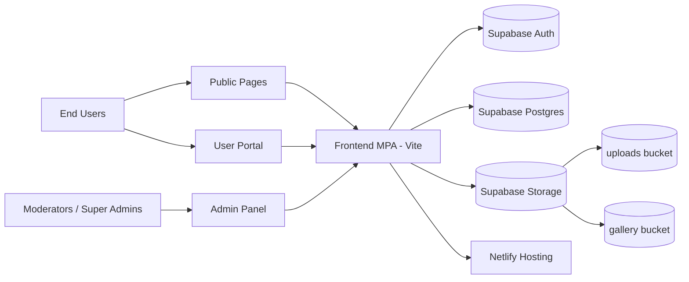
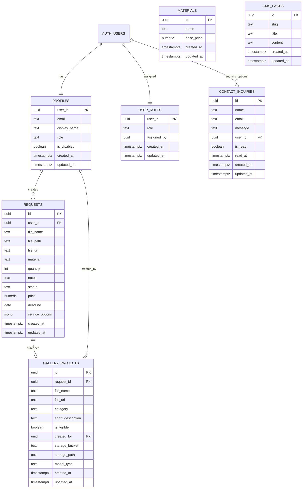
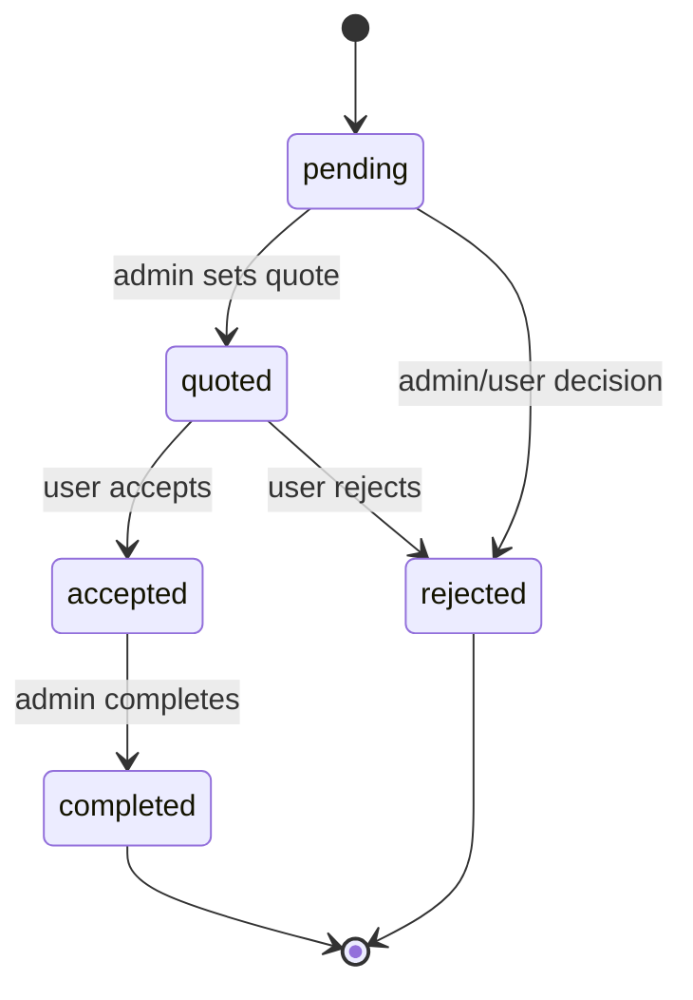
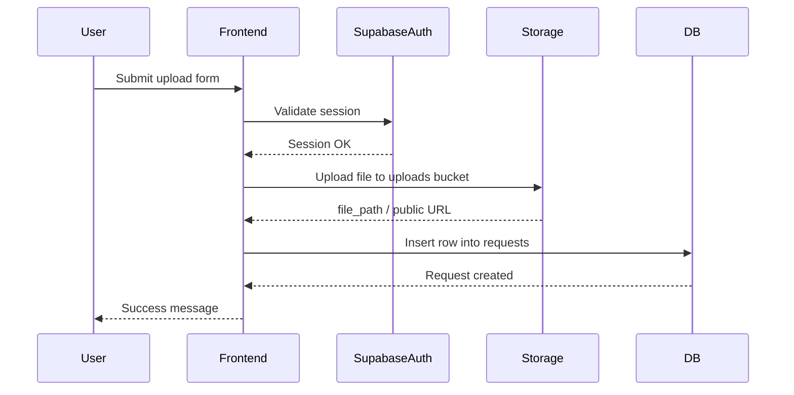
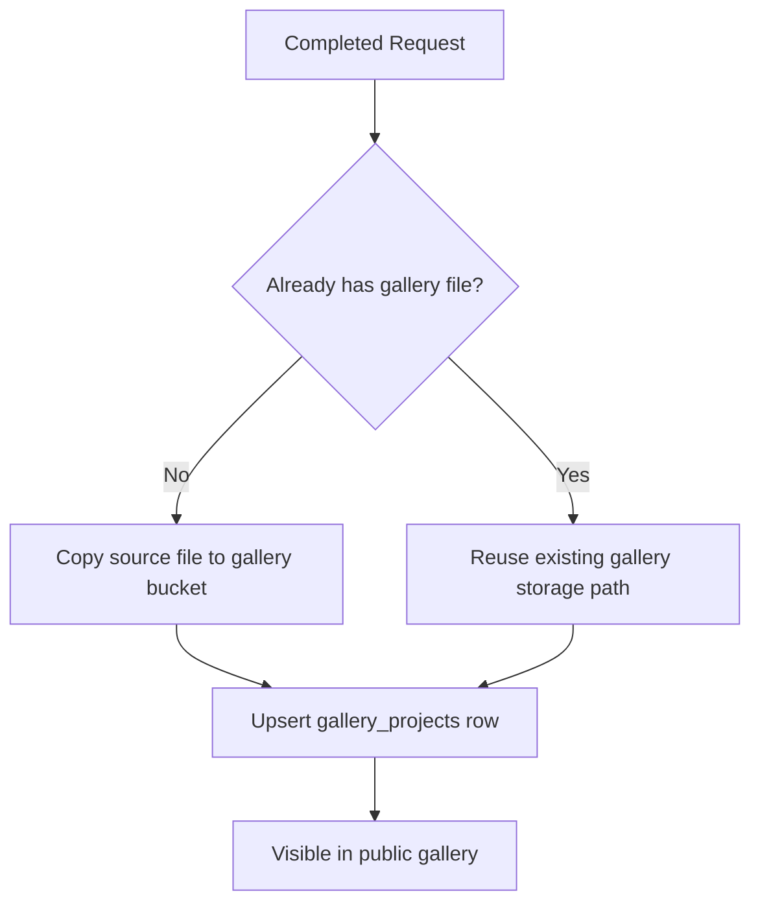

# 3D World

Production-ready web platform for 3D services (printing, modeling, scanning) with a public website, authenticated user portal, and role-based admin workspace.

## Table of Contents
- [1. Executive Summary](#1-executive-summary)
- [2. Feature Scope](#2-feature-scope)
- [3. Technology Stack](#3-technology-stack)
- [4. System Architecture](#4-system-architecture)
- [5. Database Model](#5-database-model)
- [6. Authorization and Roles](#6-authorization-and-roles)
- [7. Request Lifecycle](#7-request-lifecycle)
- [8. Key Application Flows](#8-key-application-flows)
- [9. Project Structure](#9-project-structure)
- [10. Environment and Configuration](#10-environment-and-configuration)
- [11. Local Development](#11-local-development)
- [12. Build and Deployment](#12-build-and-deployment)
- [13. Troubleshooting Guide](#13-troubleshooting-guide)
- [14. Operational Checklist](#14-operational-checklist)
- [15. Reference Files](#15-reference-files)

---

## 1. Executive Summary

3D World is a Vite Multi-Page Application (MPA) that provides:
- public product/service presentation pages;
- user authentication and request submission with 3D file uploads;
- admin tooling for operations (orders, users, materials, CMS, inquiries);
- Supabase-backed persistence, auth, storage, and role-based access control (RBAC).

The platform is designed for practical production use with:
- row-level security (RLS) in Postgres;
- storage policy enforcement;
- explicit deployment routing in Netlify;
- page-level access guards in frontend.

---

## 2. Feature Scope

### Public Website
- Landing and informational pages (`index`, `services`, `materials`, `how-it-works`, `gallery`, `contacts`).
- Contact form that stores inquiries in `contact_inquiries`.
- Gallery with model previews:
  - STL/OBJ rendered with Three.js.
  - SVG rendered as image preview.

### Authenticated User Workspace
- Email/password sign-up and sign-in via Supabase Auth.
- Upload flow for STL/OBJ/SVG to `uploads` bucket.
- Request creation with:
  - material,
  - quantity,
  - notes,
  - service options (`scan`, `model`, `print`).
- Request review and limited modification by status.

### Admin Workspace
- Operational dashboard with KPIs.
- Orders management (status, quote fields, deadline, delete, gallery publish).
- Materials management (CRUD-like pricing/admin actions).
- Contact inquiries management.
- User role and account-state management (super-admin level).
- CMS page content management (super-admin level).

---

## 3. Technology Stack

| Layer | Technology |
|---|---|
| Frontend | Vanilla JavaScript (ES Modules), HTML, CSS |
| UI | Bootstrap 5 + custom design system (`src/styles/main.css`) |
| Bundler | Vite 5 (MPA mode) |
| Backend Platform | Supabase (Postgres, Auth, Storage) |
| 3D Rendering | Three.js + STLLoader + OBJLoader |
| Hosting | Netlify |

`package.json` scripts:
- `npm run dev` – start development server
- `npm run build` – create production build in `dist`
- `npm run preview` – preview built output

---

## 4. System Architecture



### Frontend Access Guarding
- Public pages are open.
- User pages require authenticated session.
- Admin pages require role validation (`moderator` or `super_admin`).
- Super-admin pages additionally enforce `super_admin` role.

---

## 5. Database Model

## 5.1 ER Diagram



## 5.2 Data Dictionary (Operational)

| Table | Purpose | Key Relations | Notes |
|---|---|---|---|
| `profiles` | User profile and role metadata | `user_id -> auth.users.id` | Application reads role primarily from this table + role helpers |
| `user_roles` | Canonical role source for JWT/RLS verification | `user_id -> auth.users.id` | Synced with claims and profile role through triggers |
| `requests` | Core business records for user-submitted jobs | `user_id -> profiles.user_id` | Status-driven workflow (`pending`, `quoted`, `accepted`, `rejected`, `completed`) |
| `materials` | Material catalog and default pricing base | no direct FK from requests | `requests.material` is text; catalog is operational reference |
| `gallery_projects` | Public showcase records for completed requests | `request_id -> requests.id`, `created_by -> profiles.user_id` | One gallery record per request (`request_id` is unique) |
| `contact_inquiries` | Contact form submissions | optional `user_id -> auth.users.id` | Supports both anonymous and authenticated inquiries |
| `cms_pages` | Managed content for static pages | none | Admin editable content storage |

## 5.3 Storage Buckets

| Bucket | Visibility | Typical Content | Access Model |
|---|---|---|---|
| `uploads` | private | user-submitted request files | Authenticated users + policy checks by folder/user |
| `gallery` | public | admin-published showcase files | Public read; admin write/manage |

---

## 6. Authorization and Roles

### Role Definitions
- `user`: standard customer account.
- `moderator`: operations/admin access (orders, materials, inquiries).
- `super_admin`: full admin including user role management and CMS.

### Authorization Model
- Frontend uses auth/role guards.
- Postgres uses RLS policies and helper functions (`is_admin_user`, `is_super_admin_user`, JWT-verified role checks).
- Role synchronization keeps `user_roles`, `profiles.role`, and JWT claims aligned.

### Access Matrix (High Level)

| Area | user | moderator | super_admin |
|---|---:|---:|---:|
| Public pages | ✅ | ✅ | ✅ |
| User dashboard/upload/requests/profile | ✅ | ✅ | ✅ |
| Admin dashboard/orders/materials/inquiries | ❌ | ✅ | ✅ |
| Admin users management | ❌ | ❌ | ✅ |
| CMS management | ❌ | ❌ | ✅ |

---

## 7. Request Lifecycle



Lifecycle notes:
- Gallery publication is allowed only for completed requests.
- Update/edit permissions are constrained by both UI logic and database policies.

---

## 8. Key Application Flows

## 8.1 Upload + Request Creation Flow



## 8.2 Admin Publish to Gallery



---

## 9. Project Structure

```text
.
├─ app/                    # user pages (login/register/dashboard/upload/requests/profile)
├─ admin-panel/            # admin pages
├─ pages/                  # public pages (secondary HTML entries)
├─ src/
│  ├─ core/
│  │  ├─ components/       # navigation and shared UI logic
│  │  ├─ services/         # supabase/auth services
│  │  └─ utils/            # guards and utilities
│  ├─ pages/               # page-specific controllers
│  ├─ services/            # re-export layer
│  └─ styles/              # global design system
├─ database/               # SQL snapshots and manual setup scripts
├─ supabase/migrations/    # migration history and schema evolution
├─ docs/                   # operational/internal notes
├─ vite.config.js          # MPA input map
└─ netlify.toml            # deploy + redirect rules
```

---

## 10. Environment and Configuration

## 10.1 Required Environment Variables

Create `.env` in project root:

```dotenv
VITE_SUPABASE_URL=https://YOUR_PROJECT_REF.supabase.co
VITE_SUPABASE_ANON_KEY=YOUR_PUBLISHABLE_OR_ANON_KEY
```

## 10.2 Configuration Sources
- Supabase client config: `src/core/services/supabase.js`
- Auth operations: `src/core/services/auth.js`
- Route/page guards: `src/main.js`, `src/core/utils/auth-guards.js`, `src/core/utils/role-guards.js`

---

## 11. Local Development

## 11.1 Prerequisites
- Node.js 18+ (20+ recommended)
- npm
- Supabase project configured with required schema and policies

## 11.2 Install and Run

```bash
npm install
npm run dev
```

## 11.3 Build and Preview

```bash
npm run build
npm run preview
```

---

## 12. Build and Deployment

## 12.1 Netlify Setup
- Build command: `npm run build`
- Publish directory: `dist`
- Redirect definitions: `netlify.toml`

## 12.2 MPA Deployment Rule (Critical)
Every page that must exist in production must be listed in `vite.config.js` under `build.rollupOptions.input`.

If a page is missing from this input map, Netlify serves 404 for that path even if local development works.

## 12.3 Manual Deployment (Auto Deploy Disabled)
1. Build locally:
   ```bash
   npm run build
   ```
2. Open Netlify -> Site -> Deploys.
3. Trigger manual deploy (or drag-drop `dist`).
4. Verify deploy is active and paths resolve correctly.

---

## 13. Troubleshooting Guide

### 13.1 Netlify `Page not found`
- Confirm page exists in `vite.config.js` input map.
- Confirm matching redirect in `netlify.toml` if needed.
- Trigger new deploy (old artifact remains active when auto-deploy is off).

### 13.2 `Supabase env vars missing`
- Ensure `.env` contains both required `VITE_SUPABASE_*` keys.

### 13.3 Upload fails (400 / 403)
- Apply/verify storage policies from `database/STORAGE_SETUP.sql`.
- Validate MIME/extension support for STL/OBJ/SVG.
- Check user authentication state and folder policy constraints.

### 13.4 Admin page access denied
- Verify user role in `profiles` and `user_roles`.
- Verify JWT claim synchronization (`user_role`) for current session.

---

## 14. Operational Checklist

Before production release:
- [ ] `npm run build` passes.
- [ ] All production pages are present in Vite MPA input map.
- [ ] Required redirects exist in `netlify.toml`.
- [ ] Supabase RLS policies are applied (tables + storage).
- [ ] Role sync (`profiles` <-> `user_roles` <-> JWT claims) is healthy.
- [ ] Upload and request flow tested end-to-end.
- [ ] Admin inquiries/orders/materials/users access validated per role.

---

## 15. Reference Files

- `vite.config.js` – MPA page entry points
- `netlify.toml` – routing redirects and deployment behavior
- `src/main.js` – app bootstrap + page guards
- `src/core/components/nav.js` – role-aware navigation
- `src/core/services/supabase.js` – Supabase client creation
- `src/core/services/auth.js` – session/auth methods
- `database/supabase-schema.sql` – schema snapshot
- `database/STORAGE_SETUP.sql` – storage policy setup script
- `supabase/migrations/` – migration history (source of truth)
- `docs/БЪРЗА_НАСТРОЙКА.md` and `docs/STORAGE_ИНСТРУКЦИИ.md` – operational setup notes

---

For GitHub readers, this documentation is intended to be complete enough for onboarding, architecture understanding, local setup, secure deployment, and operations troubleshooting.