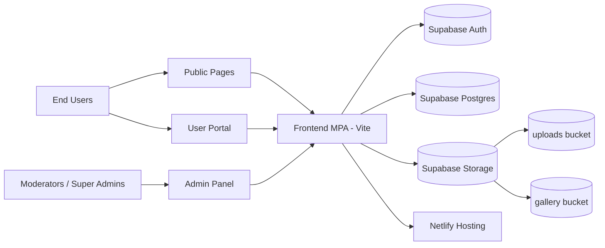
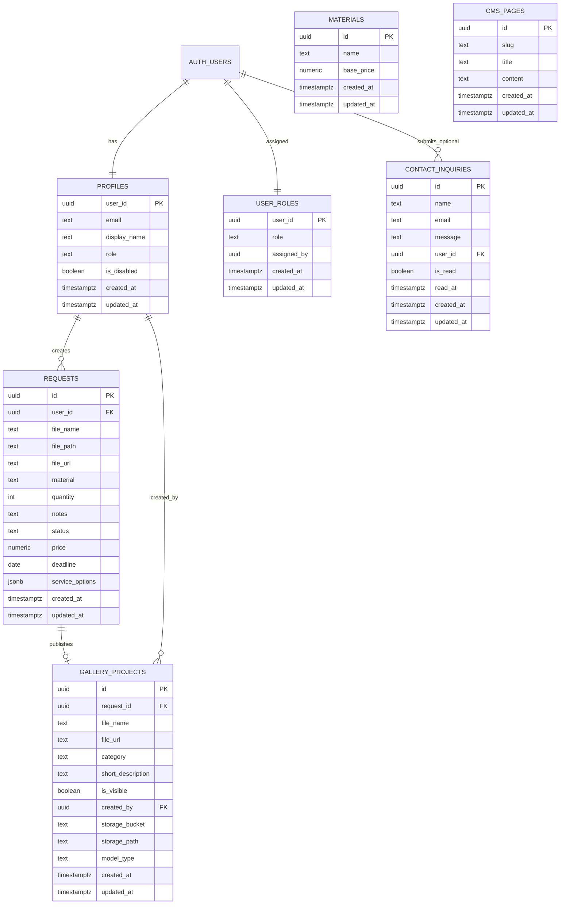
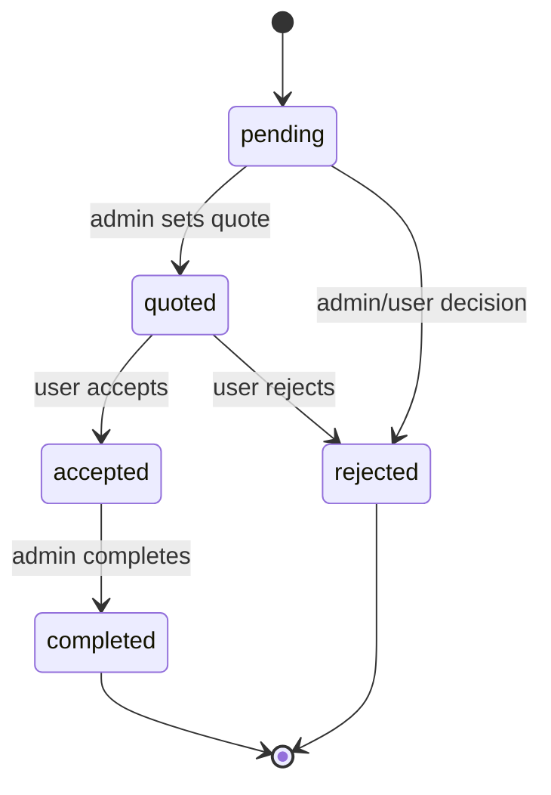
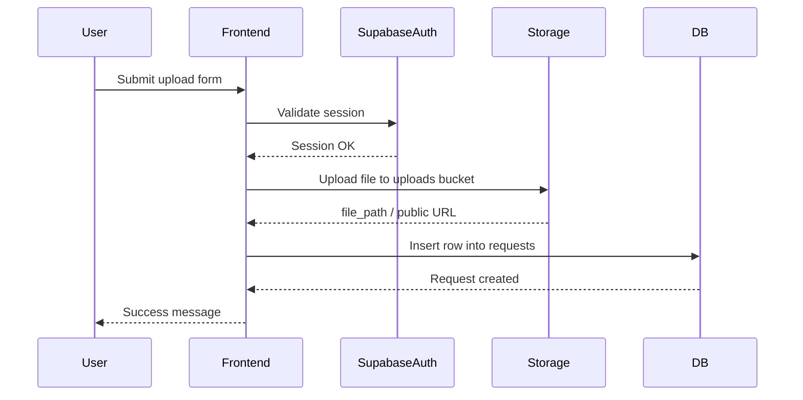
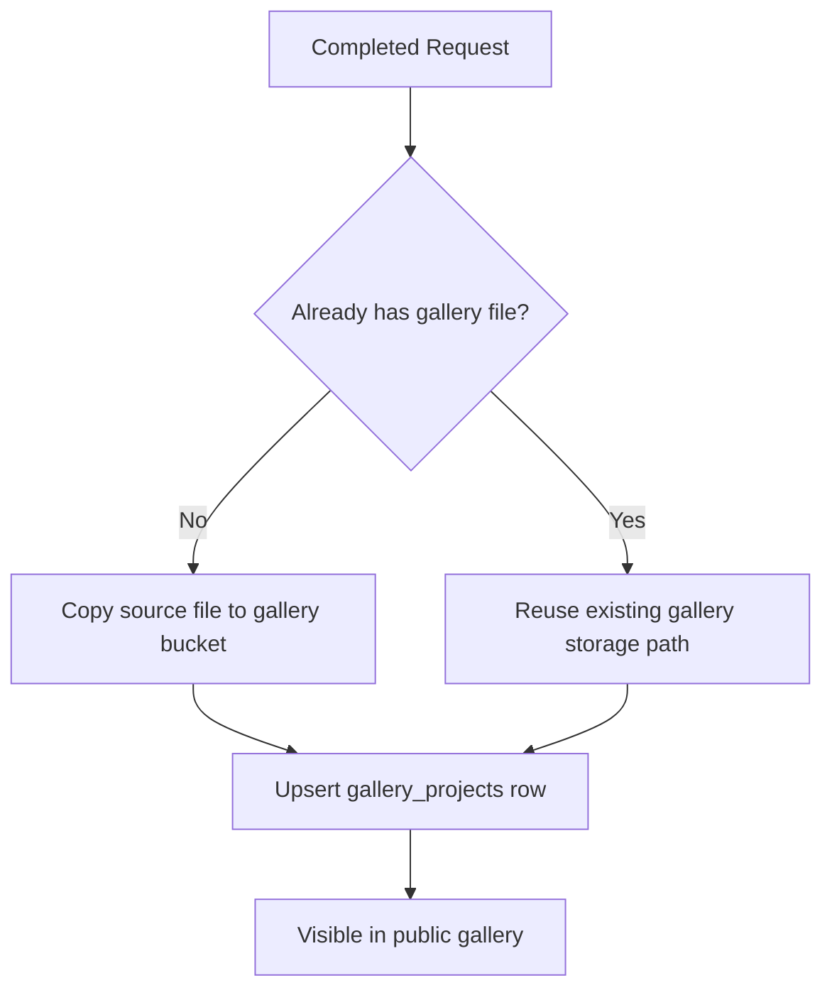

# 3D World

Production-ready уеб платформа за 3D услуги (принтиране, моделиране, сканиране) с публичен сайт, потребителски портал и role-based админ среда.

## Съдържание
- [1. Кратко резюме](#1-кратко-резюме)
- [2. Обхват на функционалностите](#2-обхват-на-функционалностите)
- [3. Технологичен стек](#3-технологичен-стек)
- [4. Системна архитектура](#4-системна-архитектура)
- [5. Модел на базата данни](#5-модел-на-базата-данни)
- [6. Авторизация и роли](#6-авторизация-и-роли)
- [7. Жизнен цикъл на заявка](#7-жизнен-цикъл-на-заявка)
- [8. Основни application потоци](#8-основни-application-потоци)
- [9. Структура на проекта](#9-структура-на-проекта)
- [10. Environment и конфигурация](#10-environment-и-конфигурация)
- [11. Локална разработка](#11-локална-разработка)
- [12. Build и deployment](#12-build-и-deployment)
- [13. Troubleshooting наръчник](#13-troubleshooting-наръчник)
- [14. Оперативен checklist](#14-оперативен-checklist)
- [15. Референтни файлове](#15-референтни-файлове)

---

## 1. Кратко резюме

3D World е Vite Multi-Page Application (MPA), която предоставя:
- публични страници за представяне на услуги и съдържание;
- потребителска автентикация и подаване на заявки с качване на 3D файлове;
- админ инструменти за операционна работа (поръчки, потребители, материали, CMS, запитвания);
- Supabase-базирани persistence, auth, storage и role-based access control (RBAC).

Платформата е подготвена за реална production употреба с:
- row-level security (RLS) в Postgres;
- policy enforcement за storage;
- ясни deployment маршрути в Netlify;
- page-level access guards във frontend.

---

## 2. Обхват на функционалностите

### Публичен сайт
- Информационни страници: `index`, `services`, `materials`, `how-it-works`, `gallery`, `contacts`.
- Контактна форма, която записва записи в `contact_inquiries`.
- Галерия с preview на модели:
  - STL/OBJ визуализация чрез Three.js;
  - SVG визуализация като изображение.

### Потребителска зона (автентикиран потребител)
- Регистрация и вход чрез Supabase Auth.
- Upload flow за STL/OBJ/SVG към `uploads` bucket.
- Създаване на заявка с:
  - материал,
  - количество,
  - бележки,
  - избрани услуги (`scan`, `model`, `print`).
- Преглед и ограничена редакция на заявки според статус.

### Админ зона
- Оперативен dashboard с KPI стойности.
- Управление на поръчки (статус, цена, срок, изтриване, публикуване в галерия).
- Управление на материали (админ действия и ценообразуване).
- Управление на контактни запитвания.
- Управление на роли/състояние на акаунти (super-admin ниво).
- CMS управление на съдържание за страници (super-admin ниво).

---

## 3. Технологичен стек

| Слой | Технология |
|---|---|
| Frontend | Vanilla JavaScript (ES Modules), HTML, CSS |
| UI | Bootstrap 5 + custom design system (`src/styles/main.css`) |
| Bundler | Vite 5 (MPA mode) |
| Backend платформа | Supabase (Postgres, Auth, Storage) |
| 3D рендериране | Three.js + STLLoader + OBJLoader |
| Hosting | Netlify |

`package.json` scripts:
- `npm run dev` – стартира development server
- `npm run build` – създава production build в `dist`
- `npm run preview` – локален preview на production build

---

## 4. Системна архитектура



### Frontend access guarding
- Публичните страници са отворени.
- Потребителските страници изискват активна сесия.
- Админ страниците изискват валидирана роля (`moderator` или `super_admin`).
- Super-admin страниците изискват изрично `super_admin` роля.

---

## 5. Модел на базата данни

## 5.1 ER диаграма



## 5.2 Data Dictionary (оперативно)

| Таблица | Предназначение | Ключови връзки | Бележки |
|---|---|---|---|
| `profiles` | Потребителски профил и role metadata | `user_id -> auth.users.id` | Приложението чете роля основно от тази таблица + role helper-и |
| `user_roles` | Каноничен source за JWT/RLS role верификация | `user_id -> auth.users.id` | Синхронизира се с claims и `profiles.role` чрез trigger-и |
| `requests` | Основни бизнес записи за потребителски заявки | `user_id -> profiles.user_id` | Status-driven workflow (`pending`, `quoted`, `accepted`, `rejected`, `completed`) |
| `materials` | Каталог на материали и базови цени | няма директен FK от `requests` | `requests.material` е текст; каталогът е оперативен референт |
| `gallery_projects` | Публични записи за завършени проекти | `request_id -> requests.id`, `created_by -> profiles.user_id` | Един gallery запис за една заявка (`request_id` е unique) |
| `contact_inquiries` | Контактни запитвания от форма | опционален `user_id -> auth.users.id` | Поддържа anonymous и authenticated запитвания |
| `cms_pages` | Управляемо съдържание за статични страници | няма | Съдържание, редактирано от админ |

## 5.3 Storage bucket-и

| Bucket | Видимост | Типично съдържание | Access модел |
|---|---|---|---|
| `uploads` | private | файлове, качени към заявки | Authenticated users + policy проверки по папка/потребител |
| `gallery` | public | файлове, публикувани в галерия | Public read; admin write/manage |

---

## 6. Авторизация и роли

### Ролеви дефиниции
- `user`: стандартен клиентски акаунт.
- `moderator`: operations/admin достъп (поръчки, материали, запитвания).
- `super_admin`: пълен админ достъп, включително user role management и CMS.

### Authorization модел
- Frontend използва auth/role guards.
- Postgres използва RLS политики и helper функции (`is_admin_user`, `is_super_admin_user`, JWT-verified role checks).
- Role synchronization поддържа `user_roles`, `profiles.role` и JWT claims в синхрон.

### Access matrix (високо ниво)

| Зона | user | moderator | super_admin |
|---|---:|---:|---:|
| Публични страници | ✅ | ✅ | ✅ |
| User dashboard/upload/requests/profile | ✅ | ✅ | ✅ |
| Admin dashboard/orders/materials/inquiries | ❌ | ✅ | ✅ |
| Admin users management | ❌ | ❌ | ✅ |
| CMS management | ❌ | ❌ | ✅ |

---

## 7. Жизнен цикъл на заявка



Lifecycle бележки:
- Публикуване в галерия е позволено само за завършени (`completed`) заявки.
- Правата за update/edit се ограничават от UI логика и database policies.

---

## 8. Основни application потоци

## 8.1 Upload + създаване на заявка



## 8.2 Admin publish към галерия



---

## 9. Структура на проекта

```text
.
├─ app/                    # user pages (login/register/dashboard/upload/requests/profile)
├─ admin-panel/            # admin pages
├─ pages/                  # public pages (secondary HTML entries)
├─ src/
│  ├─ core/
│  │  ├─ components/       # navigation and shared UI logic
│  │  ├─ services/         # supabase/auth services
│  │  └─ utils/            # guards and utilities
│  ├─ pages/               # page-specific controllers
│  ├─ services/            # re-export layer
│  └─ styles/              # global design system
├─ database/               # SQL snapshots and manual setup scripts
├─ supabase/migrations/    # migration history and schema evolution
├─ docs/                   # operational/internal notes
├─ vite.config.js          # MPA input map
└─ netlify.toml            # deploy + redirect rules
```

---

## 10. Environment и конфигурация

## 10.1 Задължителни environment променливи

Създай `.env` в root на проекта:

```dotenv
VITE_SUPABASE_URL=https://YOUR_PROJECT_REF.supabase.co
VITE_SUPABASE_ANON_KEY=YOUR_PUBLISHABLE_OR_ANON_KEY
```

## 10.2 Източници на конфигурация
- Supabase client config: `src/core/services/supabase.js`
- Auth операции: `src/core/services/auth.js`
- Route/page guards: `src/main.js`, `src/core/utils/auth-guards.js`, `src/core/utils/role-guards.js`

---

## 11. Локална разработка

## 11.1 Предварителни изисквания
- Node.js 18+ (20+ препоръчително)
- npm
- Supabase проект с приложени схема и политики

## 11.2 Инсталация и стартиране

```bash
npm install
npm run dev
```

## 11.3 Build и preview

```bash
npm run build
npm run preview
```

---

## 12. Build и deployment

## 12.1 Netlify setup
- Build command: `npm run build`
- Publish directory: `dist`
- Redirect definitions: `netlify.toml`

## 12.2 Критично правило за MPA deployment
Всяка страница, която трябва да съществува в production, трябва да бъде добавена във `vite.config.js` под `build.rollupOptions.input`.

Ако страница липсва в input map-а, Netlify ще върне 404 за този path, дори локално да работи.

## 12.3 Manual deployment (при изключен auto deploy)
1. Build локално:
   ```bash
   npm run build
   ```
2. Отвори Netlify -> Site -> Deploys.
3. Trigger manual deploy (или drag-drop на `dist`).
4. Потвърди, че deploy-ът е active и route-овете се отварят коректно.

---

## 13. Troubleshooting наръчник

### 13.1 Netlify `Page not found`
- Провери дали страницата е добавена във `vite.config.js` input map.
- Провери дали има съответен redirect в `netlify.toml` при нужда.
- Пусни нов deploy (старият artifact остава активен при изключен auto-deploy).

### 13.2 `Supabase env vars missing`
- Увери се, че `.env` съдържа и двата `VITE_SUPABASE_*` ключа.

### 13.3 Upload fail (400 / 403)
- Приложи/провери storage политики от `database/STORAGE_SETUP.sql`.
- Валидарай MIME/extension поддръжката за STL/OBJ/SVG.
- Провери authentication състоянието и folder policy ограниченията.

### 13.4 Достъпът до admin page е отказан
- Провери ролята на потребителя в `profiles` и `user_roles`.
- Провери синхронизацията на JWT claim (`user_role`) за текущата сесия.

---

## 14. Оперативен checklist

Преди production release:
- [ ] `npm run build` минава успешно.
- [ ] Всички production страници са в Vite MPA input map.
- [ ] Налични са нужните redirects в `netlify.toml`.
- [ ] Supabase RLS policies са приложени (tables + storage).
- [ ] Role sync (`profiles` <-> `user_roles` <-> JWT claims) е здрав.
- [ ] Upload и request flow са тествани end-to-end.
- [ ] Достъпът до admin inquiries/orders/materials/users е валидиран по роли.

---

## 15. Референтни файлове

- `vite.config.js` – MPA page entry points
- `netlify.toml` – routing redirects и deployment поведение
- `src/main.js` – app bootstrap + page guards
- `src/core/components/nav.js` – role-aware navigation
- `src/core/services/supabase.js` – Supabase client initialization
- `src/core/services/auth.js` – session/auth operations
- `database/supabase-schema.sql` – schema snapshot
- `database/STORAGE_SETUP.sql` – storage policy setup script
- `supabase/migrations/` – migration history (source of truth)
- `docs/БЪРЗА_НАСТРОЙКА.md` и `docs/STORAGE_ИНСТРУКЦИИ.md` – оперативни setup бележки

---

За GitHub аудиторията тази документация е достатъчно пълна за onboarding, архитектурно разбиране, локален setup, сигурен deployment и оперативно troubleshooting.